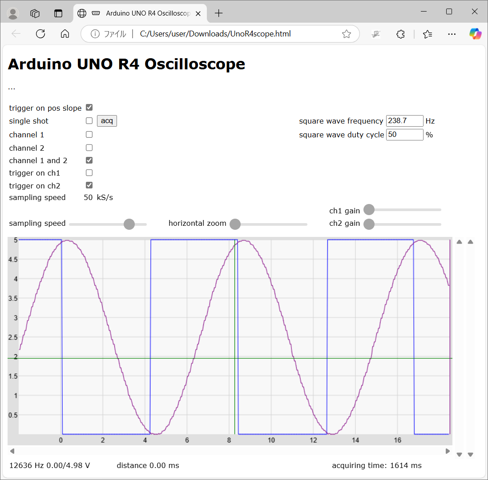

# R4USBOscilloscope
Arduino UNO R4 Minima USB dual channel oscilloscope with Pulse Generator, DDS Function Generator
This is a porting to Arduino UNO R4 Minima from <a href="https://github.com/jklomp/pico-RP2040-oscilloscope">pico-RP2040-oscilloscope</a>.

This displays an oscilloscope screen on the Web browser of the PC connected by USB.
The settings are controled on the Web page.
It contains Pulse Generator, DDS Function Generator.

Specifications:
<li>Dual input channel</li>
<li>Input voltage range 0 to 5.0V</li>
<li>12 bit ADC 346 ksps single channel, 141 ksps dual channel</li>
<li>timebase magnification x2 ... x10 linear interpolation</li>
<li>Measures minimum and maximum values</li>
<li>Measures frequency</li>
<li>Sampling rate selection</li>
<li>Built in Pulse Generator</li>
<li>Built in DDS Function Generator</li>
 

Develop environment is: 
Arduino IDE 1.8.19 
Arduino UNO R4 Boards by Arduino version 1.3.2 
Arduino UNO R4 Minima 
CPU speed 48MHz 

Libraries: 
arduinoFFT by Enrique Condes 2.0.0 

Schematics: 

Description is here, although it is written in Japanese language:
https://ss1.xrea.com/harahore.g2.xrea.com/R4/R4USBOscillo.html

References: 
The communication protocol and the HTML code comes from 
jklomp / pico-RP2040-oscilloscope　<a href="https://github.com/jklomp/pico-RP2040-oscilloscope">https://github.com/jklomp/pico-RP2040-oscilloscope</a> 
